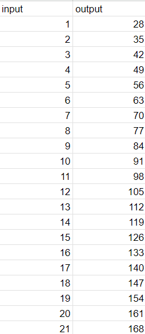
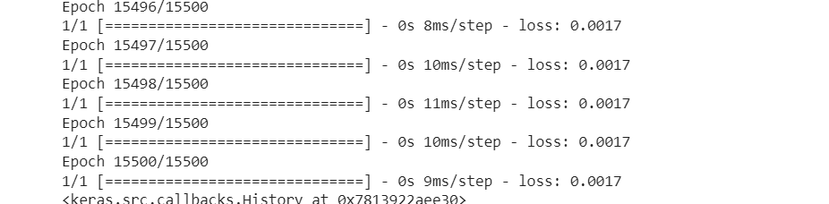
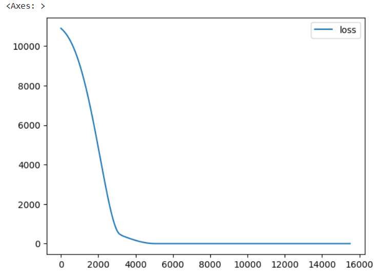
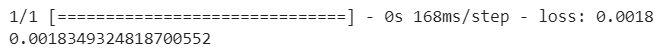
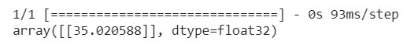

# Developing a Neural Network Regression Model

## AIM
To develop a neural network regression model for the given dataset.

## THEORY
Neural network regression models are like detectives learning how things are connected and predicting outcomes, such as prices or scores. They adjust their 'guesses' based on feedback, getting better over time. To work well, they need careful planning, like deciding how many 'detectives' to use and how much they should focus on details. Think of it like fine-tuning a radio to get the best signal. With the right setup, these models can make accurate predictions without getting confused by too much information.

## Neural Network Model
The provided description outlines a neural network architecture with two hidden layers. These hidden layers utilize ReLU activation functions and have 4 and 2 neurons, respectively. Following these hidden layers is a single-neuron output layer with a linear activation function. This network takes a single variable as input and is designed to predict continuous outputs.


## DESIGN STEPS

### STEP 1:
Loading the dataset

### STEP 2:
Split the dataset into training and testing

### STEP 3:
Create MinMaxScalar objects ,fit the model and transform the data.

### STEP 4:
Build the Neural Network Model and compile the model.

### STEP 5:
Train the model with the training data.

### STEP 6:
Plot the performance plot

### STEP 7:
Evaluate the model with the testing data.

## PROGRAM
### Name: Sudharshna Lakshmi S
### Register Number: 212221230110
```
from google.colab import auth
import gspread
from google.auth import default
import pandas as pd

auth.authenticate_user()
creds, _ = default()
gc = gspread.authorize(creds)

worksheet = gc.open('EX1').sheet1

data = worksheet.get_all_values()

dataset1 = pd.DataFrame(data[1:], columns=data[0])
dataset1 = dataset1.astype({'input':'float'})
dataset1 = dataset1.astype({'output':'float'})
dataset1.head()

import pandas
from sklearn.model_selection import train_test_split
from sklearn.preprocessing import MinMaxScaler

X = dataset1[['input']].values
y = dataset1[['output']].values
X

X_train,X_test,y_train,y_test = train_test_split(X,y,test_size = 0.33,random_state = 33)
scaler = MinMaxScaler()
scaler.fit(X_train)

X_train1 = scaler.transform(X_train)

from tensorflow.keras.models import Sequential
from tensorflow.keras.layers import Dense

model = Sequential([
    Dense(units=4,activation='relu',input_shape=[1]),
    Dense(units=2,activation='relu'),
    Dense(units=1)
])

model.compile(optimizer='rmsprop',loss='mse')
model.fit(X_train1,y_train,epochs=15000)

loss= pd.DataFrame(model.history.history)
loss.plot()

X_test1 =scaler.transform(X_test)
model.evaluate(X_test1,y_test)

X_n1=[[2]]
X_n1_1=scaler.transform(X_n1)
model.predict(X_n1_1)
```
## Dataset Information

## OUTPUT
### Epoch Training

### Training Loss Vs Iteration Plot


### Test Data Root Mean Squared Error


### New Sample Data Prediction


## RESULT
Thus a basic neural network regression model for the given dataset is written and executed successfully.
